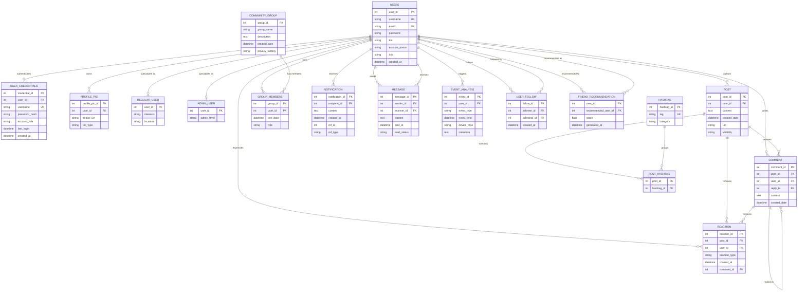

# 🌐 SocialSphere — Full-Stack Social Network & Relational Database Platform

[](https://fastapi.tiangolo.com)
[](https://reactjs.org/)
[](https://vitejs.dev/)
[](https://www.mysql.com/)
[](https://www.sqlite.org/)
[](https://jwt.io/)
[](https://web.dev/progressive-web-apps/)

**SocialSphere** is an enterprise-grade full-stack social media application and database management suite. Designed to bridge production-grade web architecture with deep relational database engineering, the platform features a **17-table normalized relational schema**, high-concurrency **FastAPI** backend with connection pooling, modern **React 18 + Vite** progressive web interface with glassmorphic aesthetics, and an in-browser **SQL Studio** with real-time Abstract Syntax Tree (AST) validation.

---

## 📑 Table of Contents

- [System Architecture](#-system-architecture)
- [Database Design & ER Diagram](#-database-design--er-diagram)
  - [Entity-Relationship Diagram](#entity-relationship-diagram)
  - [Schema Dictionary (All 17 Tables)](#schema-dictionary-all-17-tables)
  - [Design Highlights & Normalization](#design-highlights--normalization)
- [Frontend Architecture & UI/UX](#-frontend-architecture--uiux)
  - [Component Architecture](#component-architecture)
  - [Design System & Aesthetics](#design-system--aesthetics)
  - [Optimistic UI & Client Performance](#optimistic-ui--client-performance)
  - [PWA & Mobile Navigation](#pwa--mobile-navigation)
- [Backend Architecture & System Integration](#-backend-architecture--system-integration)
  - [FastAPI Modular Design](#fastapi-modular-design)
  - [Dual-Engine Database Layer](#dual-engine-database-layer)
  - [Authentication & Security Pipeline](#authentication--security-pipeline)
  - [Interactive SQL Studio Engine](#interactive-sql-studio-engine)
- [REST API Reference](#-rest-api-reference)
- [Getting Started & Local Setup](#-getting-started--local-setup)
- [Cloud Deployment](#-cloud-deployment)
- [Repository File Structure](#-repository-file-structure)
- [Credits](#-credits)

---

## 🏗️ System Architecture

```
┌────────────────────────────────────────────────────────────────────────┐
│                             CLIENT LAYER                               │
│  React 18 + Vite SPA  •  PWA Service Worker  •  Vanilla CSS Glassmorphism │
│  [Feed]   [Chat]   [Communities]   [Explore]   [SQL Studio]   [Analytics]│
└───────────────────────────────────┬────────────────────────────────────┘
                                    │ HTTP / REST / JSON
                                    ▼
┌────────────────────────────────────────────────────────────────────────┐
│                      BACKEND & INTEGRATION LAYER                       │
│  FastAPI (Asynchronous)  •  GZip Compression  •  JWT & Bcrypt Security │
│  ┌──────────────┐ ┌──────────────┐ ┌──────────────┐ ┌──────────────┐   │
│  │ Users Router │ │ Posts Router │ │ Chat Router  │ │ Groups Router│   │
│  └──────────────┘ └──────────────┘ └──────────────┘ └──────────────┘   │
│  ┌──────────────┐ ┌──────────────┐ ┌──────────────┐ ┌──────────────┐   │
│  │ Notifications│ │Recs Engine   │ │Analytics Log │ │ SQL Studio   │   │
│  └──────────────┘ └──────────────┘ └──────────────┘ └──────────────┘   │
│                                   │                                    │
│         Database Abstraction & Auto-Fallback Manager (`db.py`)         │
└───────────────────┬───────────────────────────────┬────────────────────┘
                    │                               │
       Primary (Pool)│                               │ Fallback / Zero-Conf
                    ▼                               ▼
┌──────────────────────────────────────┐ ┌───────────────────────────────┐
│           MySQL 8.0 Engine           │ │        SQLite 3 Engine        │
│  PooledDB Concurrency (2-50 Conns)   │ │  Zero-Config Local File DB    │
│  17 Normalized Relational Tables     │ │  Pre-Seeded Sample Data       │
└──────────────────────────────────────┘ └───────────────────────────────┘
```

---

## 🗄️ Database Design & ER Diagram

The data tier is engineered in Third Normal Form (3NF) to support a high-velocity social network while maintaining ACID compliance, strict referential integrity, and efficient query performance.

### Entity-Relationship Diagram



---

### Schema Dictionary (All 17 Tables)

#### 1. Identity & Profile Modules
- **`Users`**: Central entity holding user records. Contains `user_id` (PK, Auto Increment), `username` (Unique), `email` (Unique), `password`, `bio`, `account_status` (Default: `'ACTIVE'`), `dob`, and `created_at`.
- **`User_Credentials`**: Decoupled authentication security table storing `credential_id` (PK), `user_id` (FK -> `Users`, 1-to-1 Unique), `username`, `password_hash`, `account_role` (`'USER'` or `'ADMIN'`), `last_login`, and `created_at`.
- **`Profile_Pic`**: Handles user avatars and banner assets. Stores `profile_pic_id` (PK), `user_id` (FK -> `Users`), `image_url`, and `pic_type` (`'AVATAR'` or `'BANNER'`).
- **`Regular_User`**: Sub-type entity table modeling standard user attributes. Stores `user_id` (PK / FK -> `Users`), `interests`, and `location`.
- **`Admin_User`**: Sub-type entity table for administrative privileges. Stores `user_id` (PK / FK -> `Users`) and `admin_level` (`'SUPER_ADMIN'`, `'MODERATOR'`).

#### 2. Content & Social Engagement Modules
- **`Post`**: Core social publication table storing `post_id` (PK), `user_id` (FK -> `Users`), `content`, `created_date`, `url` (optional image/link attachment), and `visibility` (`'PUBLIC'`, `'FOLLOWERS'`).
- **`Comment`**: Hierarchical discussion table. Stores `comment_id` (PK), `post_id` (FK -> `Post`), `user_id` (FK -> `Users`), `reply_to` (Self-referencing FK -> `Comment.comment_id` enabling threaded discussions), `content`, and `created_date`.
- **`Reaction`**: Polymorphic engagement table supporting posts and comments. Stores `reaction_id` (PK), `post_id` (FK -> `Post`), `user_id` (FK -> `Users`), `reaction_type` (`'LIKE'`, `'LOVE'`, `'FIRE'`), `comment_id` (Optional FK -> `Comment`), and `created_at`.

#### 3. Community & Content Discovery Modules
- **`Community_Group`**: Channel/group entities containing `group_id` (PK), `group_name`, `description`, `created_date`, and `privacy_setting`.
- **`Group_Members`**: Composite associative table modeling group memberships. Uses composite PK `(group_id, user_id)`, `join_date`, and `role` (`'CREATOR'`, `'ADMIN'`, `'MEMBER'`).
- **`Hashtag`**: Content taxonomy table storing `hashtag_id` (PK), `tag` (Unique, indexed), and `category`.
- **`Post_Hashtag`**: Associative junction table linking posts to hashtags using composite PK `(post_id, hashtag_id)`.

#### 4. Communication & Relationship Modules
- **`Message`**: Direct messaging entity storing `message_id` (PK), `sender_id` (FK -> `Users`), `receiver_id` (FK -> `Users`), `content`, `sent_at`, and `read_status` (`'UNREAD'`, `'READ'`).
- **`User_Follow`**: Social graph relationship table storing `follow_id` (PK), `follower_id` (FK -> `Users`), `following_id` (FK -> `Users`), and `created_at`. Enforces uniqueness on `(follower_id, following_id)` and check constraint `follower_id <> following_id`.
- **`Friend_Recommendation`**: Algorithmic match records storing composite PK `(user_id, recommended_user_id)`, `score` (compatibility float 0.0 - 1.0), and `generated_at`.
- **`Notification`**: Activity alerts storing `notification_id` (PK), `recipient_id` (FK -> `Users`), `content`, `created_at`, `ref_id` (referenced entity ID), and `ref_type` (`'POST'`, `'COMMENT'`, `'FOLLOW'`, `'MESSAGE'`).

#### 5. Telemetry & Analytics Module
- **`Event_Analysis`**: Platform audit log capturing system events. Stores `event_id` (PK), `user_id` (FK -> `Users`), `event_type` (`'LOGIN'`, `'CREATE_POST'`, `'REACT'`, `'FOLLOW'`), `event_time`, `device_type` (`'Desktop'`, `'Mobile'`, `'Tablet'`), and `metadata` (JSON payload).

---

### Design Highlights & Normalization

1. **Third Normal Form (3NF) Strict Compliance**:
   - Transitive dependencies are removed: authentication credentials, profile media, and authorization tiers reside in specialized tables (`User_Credentials`, `Profile_Pic`, `Admin_User`, `Regular_User`) linked by primary key relationships.
2. **Referential Integrity with Cascading Deletes**:
   - All child foreign key constraints implement `ON DELETE CASCADE`. When a user or post is deleted, orphaned comments, reactions, hashtags, and audit traces are automatically pruned without orphaned records.
3. **Integrity Constraints**:
   - Uniqueness constraints prevent duplicate follows, repeated group memberships, and duplicate email/username registrations.
   - Check constraints enforce business logic at the schema level: `CHECK (follower_id <> following_id)` and `CHECK (user_id <> recommended_user_id)`.
4. **Targeted B-Tree Indexing**:
   - High-cardinality lookups are accelerated with compound indices:
     - `idx_users_username` & `idx_users_email` on `Users`
     - `idx_post_created (created_date DESC)` on `Post` for rapid chronologically sorted feeds
     - `idx_reaction_post_user (post_id, user_id)` for sub-millisecond reaction toggle checking
     - `idx_msg_pair (sender_id, receiver_id, sent_at)` for thread history retrieval

---

## 🎨 Frontend Architecture & UI/UX

The client application is built with **React 18** and bundled with **Vite**. It provides a single-page application experience with zero layout shift, instantaneous optimistic interactions, and an accessible mobile-first responsive layout.

### Component Architecture

```
frontend/src/
├── App.jsx                     # Core application orchestrator, navigation state & active view router
├── main.jsx                    # React root mounting and service worker initialization
├── index.css                   # Comprehensive design token system, utility classes & animations
├── api/
│   └── client.js               # Centralized Fetch client with JWT authorization injection
├── components/
│   ├── AuthGate.jsx            # Unified login, register, and dynamic role-selection modal
│   ├── Sidebar.jsx             # Desktop navigation drawer with active route badges & user summary
│   ├── MobileNav.jsx           # Fixed bottom navigation bar for mobile touch screens
│   ├── Feed/
│   │   ├── FeedTab.jsx         # Post creation input, hashtag explorer bar, and sorted stream
│   │   ├── PostCard.jsx        # Individual post card with reaction bar, comment box, and media
│   │   └── ReactionBar.jsx     # Animated reaction buttons (Like 👍, Love ❤️, Fire 🔥)
│   ├── Messages/
│   │   └── MessagesTab.jsx     # Direct messaging split-pane, chat thread & contact list
│   ├── Communities/
│   │   └── CommunitiesTab.jsx  # Community grid, member counter, join/leave and group creator
│   ├── Connections/
│   │   └── ConnectionsTab.jsx  # Algorithmic friend cards with compatibility score meters
│   ├── Users/
│   │   └── UsersTab.jsx        # Platform member directory with follow/unfollow and role badges
│   ├── Analytics/
│   │   └── AnalyticsTab.jsx    # Real-time metric cards, trending hashtag badges, and audit log
│   ├── SqlStudio/
│   │   ├── SqlStudioTab.jsx    # SQL query console, execution timer, presets, and schema viewer
│   │   ├── SchemaViewer.jsx    # Table schema inspector with column types and primary keys
│   │   └── ResultTable.jsx     # Query output grid with CSV and JSON export buttons
│   ├── Modals/
│   │   ├── CreatePostModal.jsx # Post creation overlay with visibility settings
│   │   └── ProfileModal.jsx    # Profile customization (bio, location, avatar URL)
│   ├── NexoMascot.jsx          # Interactive animated mascot providing user feedback & tips
│   └── InstallAppPrompt.jsx    # Native PWA installation banner for mobile and desktop
```

### Design System & Aesthetics

- **Curated Palette**: Warm cream background (`#FAFAF9`), deep slate primary text (`#0F172A`), rich royal blue accents (`#2563EB`), and subtle indigo accents.
- **Glassmorphic Depth**: Multi-layered backdrop blurs (`backdrop-filter: blur(16px)`), subtle semi-transparent borders (`rgba(255, 255, 255, 0.6)`), and elevated drop shadows create a clean, contemporary feel.
- **Micro-Animations & Transitions**: CSS cubic-bezier transitions on hover, reaction buttons that pop on click, and smooth slide-in modals.

### Optimistic UI & Client Performance

- **0ms Perceived Latency**:
  - Reaction clicks immediately increment local counters and toggle highlight state before network confirmation.
  - Follow/unfollow buttons update their visual state instantly.
  - New posts and direct messages append to local state immediately while background network requests complete.
- **Smart Data Fetching**:
  - In-memory active tab switching without unmounting views.
  - Response caching across navigation events prevents unnecessary API calls.

### PWA & Mobile Navigation

- **Progressive Web App**: Manifest configuration (`manifest.json`) and service worker (`sw.js`) enable "Add to Home Screen" capabilities on Android, iOS, and desktop browsers.
- **Mobile-First Touch UX**:
  - Desktop sidebar gracefully collapses into a touch-friendly bottom navigation bar on screens under `768px`.
  - Floating Action Button (FAB) enables one-tap post creation on mobile devices.

---

## ⚡ Backend Architecture & System Integration

The server is built with **FastAPI** on **Python 3.9+**, optimized for asynchronous execution, secure authentication, and resilient database communication.

### FastAPI Modular Design

Routes are modularized into domain-specific controllers located in `routers/`:

- `routers/users.py`: Authentication, user registration, profile retrieval, profile updates, and follow/unfollow operations.
- `routers/posts.py`: Feed generation, post creation, hashtag extraction, reactions, and comment tree handling.
- `routers/messages.py`: Direct messaging history, conversation threading, unread counter management, and message dispatch.
- `routers/groups.py`: Community creation, membership roster retrieval, and join/leave toggling.
- `routers/recommendations.py`: Algorithmic friend suggestions ordered by compatibility score.
- `routers/notifications.py`: User notification queries, unread indicators, and notification dismissal.
- `routers/analytics.py`: Cross-table entity aggregation counters, audit event stream, and trending hashtag frequency counts.
- `routers/sql.py`: In-browser SQL execution engine, database schema metadata extraction, and query preset management.

### Dual-Engine Database Layer

The database connection engine (`db.py`) provides intelligent dual-engine support:

```python
# Automatic Engine Selection in db.py:
# 1. Attempts to connect to MySQL 8.0 using environment credentials (DB_HOST, DB_USER, etc.)
# 2. Configures a PooledDB connection pool with 2 to 50 concurrent connections.
# 3. If MySQL is unreachable, it automatically falls back to SQLite3 ('social_media.db').
```

- **Production MySQL 8.0**: Employs `dbutils.pooled_db.PooledDB` to maintain persistent connection pools, eliminating TCP handshake overhead for high-concurrency workloads.
- **Zero-Config SQLite Fallback**: Enables immediate local execution without requiring a local MySQL service. The SQLite database is automatically generated and seeded on first launch.
- **Unified Query Interface**: Standardized helpers (`query_all`, `query_one`, `execute_write`) normalize SQL execution across both engines with automatic dictionary-style row mapping.

### Authentication & Security Pipeline

- **Password Hashing**: Implements Bcrypt with 12 salt rounds (`auth.py`). Passwords are never stored in plaintext.
- **Password Complexity Validation**: Enforces a minimum of 8 characters, with required uppercase, lowercase, numeric, and special characters.
- **JWT Authorization**: Issues JSON Web Tokens (HS256) upon authentication. Protected endpoints verify authorization headers using FastAPI's `HTTPBearer` dependency injection.
- **Role-Based Access Control**: Distinguishes between `USER` and `ADMIN` privileges, guarding administrative endpoints and SQL Studio execution.

### Interactive SQL Studio Engine

The `/sql` Studio route provides an in-browser database console for administrators:

- **AST Read-Only Protection**: Every incoming query is parsed into an Abstract Syntax Tree via `sqlparse`. Any mutating statements (`INSERT`, `UPDATE`, `DELETE`, `DROP`, `ALTER`, `TRUNCATE`, `REPLACE`, `EXEC`) are blocked with an HTTP 400 response.
- **Multi-Statement Defense**: Prohibits semicolon-delimited compound queries to prevent SQL injection attacks.
- **Performance Benchmarking**: Measures query execution time with microsecond accuracy and returns elapsed time (`⏱️ ms`) with every result set.
- **Rolling Window Rate Limiter**: Enforces a limit of 30 queries per 60 seconds per IP to protect database resources.

---

## 📡 REST API Reference

### 🔐 Authentication & Users (`routers/users.py`)

| Method | Endpoint | Auth | Description |
| :--- | :--- | :---: | :--- |
| `POST` | `/api/users/login` | No | Authenticates user credentials, returns JWT bearer token & profile |
| `POST` | `/api/users/register` | No | Creates new user account, profile picture, and role entry |
| `GET` | `/api/users/me` | Yes | Retrieves profile of currently authenticated user |
| `PUT` | `/api/users/profile` | Yes | Updates bio, location, interests, or avatar URL |
| `GET` | `/api/users` | No | Lists all platform users with follow status and role badges |
| `GET` | `/api/users/{user_id}` | No | Retrieves detailed profile for a specific user |
| `POST` | `/api/users/{target_id}/follow` | Yes | Follows a target user (creates `User_Follow` record) |
| `POST` | `/api/users/{target_id}/unfollow` | Yes | Unfollows a target user |
| `GET` | `/api/users/{user_id}/followers` | No | Lists followers of a specified user |
| `GET` | `/api/users/{user_id}/following` | No | Lists users followed by a specified user |

### 📝 Posts, Reactions & Comments (`routers/posts.py`)

| Method | Endpoint | Auth | Description |
| :--- | :--- | :---: | :--- |
| `GET` | `/api/posts` | No | Fetches feed posts with comments, reaction tallies, and hashtags |
| `POST` | `/api/posts` | Yes | Publishes new post; automatically parses `#hashtags` |
| `POST` | `/api/posts/{post_id}/react` | Yes | Toggles reaction (`LIKE`, `LOVE`, `FIRE`) on a post |
| `POST` | `/api/posts/{post_id}/comments` | Yes | Adds a comment or nested reply to a post |
| `DELETE`| `/api/posts/{post_id}` | Yes | Deletes an author's post and cascades related child rows |

### 💬 Direct Messaging (`routers/messages.py`)

| Method | Endpoint | Auth | Description |
| :--- | :--- | :---: | :--- |
| `GET` | `/api/messages/conversations` | Yes | Returns list of active chat partners with last message preview |
| `GET` | `/api/messages/thread/{partner_id}`| Yes | Retrieves chronological message history with a partner |
| `POST` | `/api/messages` | Yes | Sends a direct message to another user |

### 👥 Communities & Groups (`routers/groups.py`)

| Method | Endpoint | Auth | Description |
| :--- | :--- | :---: | :--- |
| `GET` | `/api/groups` | No | Lists all community groups with membership counts |
| `POST` | `/api/groups` | Yes | Creates a new community group and assigns creator role |
| `POST` | `/api/groups/{id}/toggle-join` | Yes | Joins or leaves a community group |

### 🔍 Discovery, Recommendations & Analytics

| Method | Endpoint | Auth | Description |
| :--- | :--- | :---: | :--- |
| `GET` | `/api/recommendations/{user_id}` | No | Retrieves algorithmic friend recommendations |
| `GET` | `/api/notifications/{user_id}` | Yes | Retrieves user notification stream |
| `GET` | `/api/analytics/overview` | No | Aggregates row counts across all 17 tables |
| `GET` | `/api/analytics/events` | No | Retrieves recent system event telemetry |
| `GET` | `/api/analytics/hashtags` | No | Retrieves trending hashtags ordered by post count |

### 💻 Interactive SQL Studio (`routers/sql.py`)

| Method | Endpoint | Auth | Description |
| :--- | :--- | :---: | :--- |
| `POST` | `/api/sql/execute` | Yes/Opt | Validates and executes read-only SQL queries; returns execution time |
| `GET` | `/api/sql/schema` | No | Returns complete table schema, column definitions, and row counts |
| `GET` | `/api/sql/presets` | No | Returns curated SQL queries for quick data exploration |

---

## 🚀 Getting Started & Local Setup

### Prerequisites
- **Python 3.9+**
- **Node.js 18+** & **npm**
- *(Optional)* **MySQL 8.0** (The application will run out-of-the-box using built-in SQLite if MySQL is not running)

---

### Step 1: Clone the Repository
```bash
git clone https://github.com/Rajarshi10/social-media-backend.git
cd social-media-backend
```

### Step 2: Configure Environment Variables
Create a `.env` file in the root directory:
```bash
cp .env.example .env
```
Edit `.env` to match your local environment:
```ini
PORT=5000
HOST=0.0.0.0
ENV=development

# MySQL Configuration (Optional - falls back to SQLite automatically)
DB_HOST=127.0.0.1
DB_PORT=3306
DB_USER=root
DB_PASSWORD=your_mysql_password
DB_NAME=social_media

# Security
JWT_SECRET_KEY=super-secret-dev-jwt-key-2026
```

### Step 3: Set Up the Python Backend
```bash
# Create and activate virtual environment
python -m venv venv

# On Windows:
venv\Scripts\activate
# On macOS / Linux:
source venv/bin/activate

# Install dependencies
pip install -r requirements.txt
```

### Step 4: Build the React Frontend
```bash
cd frontend
npm install
npm run build
cd ..
```
*(The compiled production bundle is written to `frontend/dist/` and served automatically by FastAPI).*

### Step 5: Run the Application
```bash
python main.py
```
Or with Uvicorn directly:
```bash
uvicorn main:app --host 127.0.0.1 --port 5000 --reload
```

### Step 6: Access the Application
- 🌐 **Web Application**: [http://localhost:5000](http://localhost:5000)
- 💻 **SQL Studio**: [http://localhost:5000/sql](http://localhost:5000/sql)
- 📚 **Interactive Swagger API Docs**: [http://localhost:5000/docs](http://localhost:5000/docs)
- 📖 **ReDoc API Documentation**: [http://localhost:5000/redoc](http://localhost:5000/redoc)

---
## 📁 Repository File Structure

```
social-media-backend/
├── auth.py                  # JWT creation, Bcrypt password hashing & auth middleware
├── db.py                    # Database connection manager (MySQL pooling + SQLite fallback)
├── main.py                  # FastAPI app factory, middleware, router mounts & static SPA serving
├── requirements.txt         # Python dependencies (fastapi, uvicorn, pymysql, dbutils, bcrypt, etc.)
├── package.json             # Root workspace scripts
├── schema_mysql.sql         # 17-table schema definition with indices and constraints
├── render.yaml              # Render cloud infrastructure blueprint
├── klouds.yaml              # Klouds.online fullstack deployment configuration
├── Procfile                 # Platform process declaration for web services
├── .env.example             # Template for required environment variables
├── routers/
│   ├── analytics.py         # Platform metrics, hashtag trending, and audit log endpoints
│   ├── groups.py            # Community groups and membership management
│   ├── messages.py          # Direct messaging threads and conversation list
│   ├── notifications.py     # Notification retrieval and dismissal
│   ├── posts.py             # Feed posts, comments, reactions, and hashtag parsing
│   ├── recommendations.py   # Compatibility-scored friend recommendations
│   ├── sql.py               # AST-validated SQL query engine & schema inspector
│   └── users.py             # User authentication, profiles, and follower graph
├── frontend/
│   ├── index.html           # HTML5 document shell with PWA tags & Google Fonts
│   ├── vite.config.js       # Vite configuration with API reverse proxy
│   ├── package.json         # Frontend dependencies and build scripts
│   └── src/
│       ├── App.jsx          # Root view container and routing logic
│       ├── main.jsx         # React DOM mount point
│       ├── index.css        # Vanilla CSS design system (tokens, utilities, glassmorphism)
│       ├── api/client.js    # Fetch client with auto-injected authorization headers
│       └── components/      # Modular UI components (Feed, Chat, SQL Studio, Modals, etc.)
└── static/                  # Legacy static assets and fallback icons
```

---

## 👥 Credits

| Contributor | Focus Area | Key Contributions |
| :--- | :--- | :--- |
| **Kandarp** | **Database Design** | Relational schema modeling (17 tables in 3NF), integrity constraints (`ON DELETE CASCADE`, check constraints), composite B-Tree indexing, cross-engine compatibility (MySQL 8.0 & SQLite 3), and realistic dataset seeding. |
| **Aditi** | **Frontend** | React 18 + Vite single-page application, custom Vanilla CSS glassmorphic design system, 0ms optimistic UI updates (reactions, follows, comments, posts), responsive mobile bottom navigation, and PWA integration. |
| **Rajarshi** | **Backend & Integration** | Asynchronous FastAPI REST architecture, `dbutils` connection pooling with SQLite fallback, Bcrypt (12 rounds) & JWT authentication, AST-validated `/sql` Studio engine, static asset serving, and cloud deployment pipelines. |
